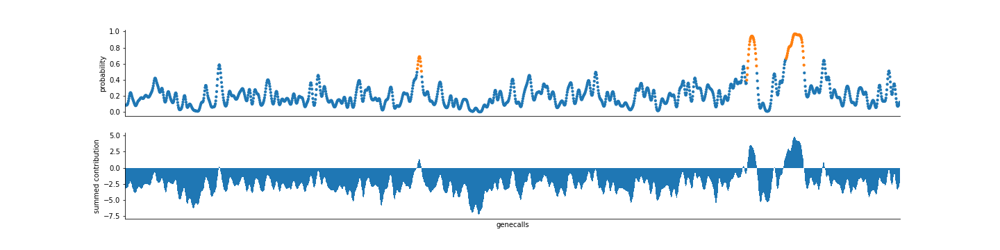

# PhageBoost
Rapid discovery of novel prophages using biological feature engineering and machine learning  
TBA  

## Introduction 

Prophage predictor based on gene features against a background. 

Prophages are phages integrated into prokaryotic genomes that drive many aspects of bacterial biology.  Their extreme diversity means they are challenging to detect using sequence similarity. We present a novel fast and generalizing machine learning method to facilitate novel phage discovery.

## Publications

to be added  


## Getting Started
### Installation
#### from PyPi
```
conda create -n PhageBoost1 python=3.7 &&
conda activate PhageBoost1 &&
pip install PhageBoost
```
#### from github
```
conda create -n PhageBoost python=3.7 &&
conda activate PhageBoost &&
git clone git@github.com:ku-cbd/PhageBoost.git &&
cd PhageBoost/ &&
python setup.py bdist_wheel &&
pip install --user . 
```

### CLI 
```
PhageBoost -h
PhageBoost -f example/data/NC_000907.fasta.gz -o results
```
### Notebooks
There are basic notebook examples in the ```notebooks/```
These notebooks provide a way how to bring your own genecalls to PhageBoost.
You can connect your PhageBoost kernel to your pre-existing Jupyter via ipykernel:

```
conda activate PhageBoost
pip install ipykernel
python -m ipykernel install --user --name PhageBoost --display-name "PhageBoost" 
```
